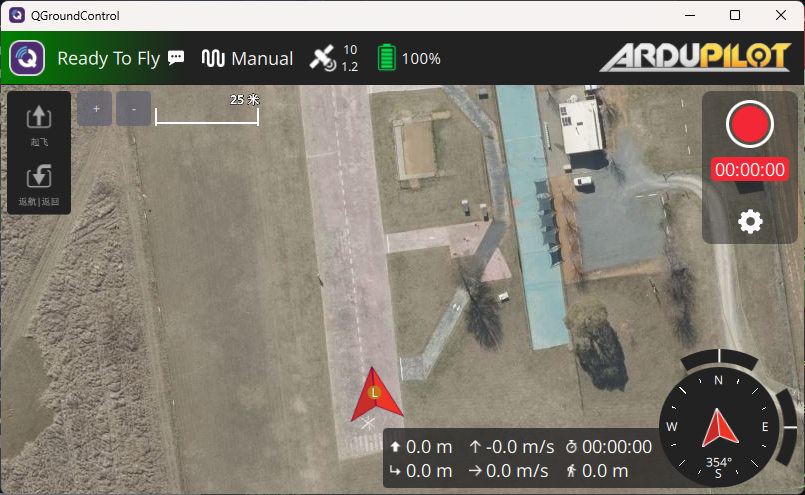
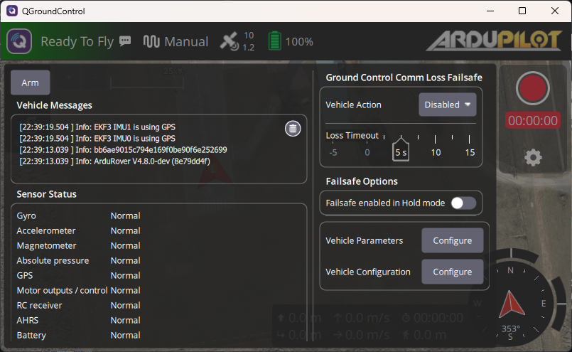

clone源码：fork一个自己的仓库

```sh
git clone --recurse-submodules <your-fork-url>
```

## Linux / WSL2 环境配置

Linux有自己的安装脚本，gcc-arm-none-eabi会有脚本无法安装的情况，自己拿包管理器装就行了，实际测试可以编译成功

```sh
sudo apt-get update
sudo apt-get install git
sudo apt-get install gitk git-gui
Tools/environment_install/install-prereqs-ubuntu.sh -y
~/.profile
```

## macOS

在开始之前确认安装好 xcode 和 brew，python3

### 建立 python 虚拟环境

试过了不能用conda，只能用python的venv，注意不要使用conda的python创建虚拟环境

```sh
cd ardupilot
conda deactivate
python3 -m venv ardupilot-venv # 建立名字为 ardupilot-venv 的虚拟环境
source ardupilot-venv/bin/activate # 启动虚拟环境
brew install gcc-arm-none-eabi genromfs
brew install gawk
python3 -m pip install empy pyserial
```

安装mavproxy

```sh
sudo python3 -m pip install wxPython
sudo python3 -m pip install gnureadline
sudo python3 -m pip install billiard
sudo python3 -m pip install numpy pyparsing
sudo python3 -m pip install MAVProxy
python3 -m pip install pexpect
python3 -m pip install dronecan
```

## 编译构建项目

### 设置编译选项

ardupilot使用waf编译，waf是一个基于 Python 的跨平台构建系统，主要用于自动编译和安装 C/C++ 等代码。waf不需要额外安装，已经包含在ardupilot项目的文件夹里了。

以编译运行在pixhawk4上的rover代码为例，pixhawk4的MCU是STM32F765，ardupilot运行在ChibiOS(一种RTOS)上

```sh
./waf configure --board Pixhawk4
Setting top to                           : /home/akatsuki/ardupilot
Setting out to                           : /home/akatsuki/ardupilot/build
Autoconfiguration                        : enabled
Checking for program 'python'            : /home/akatsuki/venv-ardupilot/bin/python3
Checking for python version >= 3.9.0     : 3.12.3
Setting board to                         : Pixhawk4
Using toolchain                          : arm-none-eabi
Checking for 'g++' (C++ compiler)        : /usr/bin/arm-none-eabi-g++
Checking for 'gcc' (C compiler)          : /usr/bin/arm-none-eabi-gcc
Checking for c flags '-MMD'              : yes
Checking for cxx flags '-MMD'            : yes
Checking for program 'arm-none-eabi-nm'  : /usr/bin/arm-none-eabi-nm
CXX Compiler                             : g++ 13.2.1
Checking for program 'make'              : /usr/bin/make
Checking for program 'arm-none-eabi-objcopy' : /usr/bin/arm-none-eabi-objcopy
Processing /home/akatsuki/ardupilot/libraries/AP_HAL_ChibiOS/hwdef/Pixhawk4/hwdef.dat
Processing /home/akatsuki/ardupilot/libraries/AP_HAL_ChibiOS/hwdef/fmuv5/hwdef.dat
Removing PB1
Removing PB1
Removing PC7
Removing PC7
Removing HAL_BATT_VOLT_SCALE
Removing HAL_BATT_VOLT_SCALE
Removing HAL_BATT_CURR_SCALE
Removing HAL_BATT_CURR_SCALE
Setup for MCU STM32F767xx
Default parameters path from hwdef: /home/akatsuki/ardupilot/libraries/AP_HAL_ChibiOS/hwdef/Pixhawk4/defaults.parm
Writing hwdef setup in /home/akatsuki/ardupilot/build/Pixhawk4/hwdef.h
MCU Flags: cortex-m7 ['-mcpu=cortex-m7', '-mfpu=fpv5-d16', '-mfloat-abi=hard']
args=['AP_Baro_MS5611::probe', '"ms5611"']
Writing DMA map
Setting up as normal
Generating ldscript.ld
env set ENABLE_DFU_BOOT=0
env set WITH_FATFS=1
env set PROCESS_STACK=0x1C00
env set MAIN_STACK=0x600
env set IOMCU_FW=0
env set IOMCU_FW_WITH_HEATER=0
env set PERIPH_FW=0
env set HAL_NUM_CAN_IFACES=2
env set HAL_CANFD_SUPPORTED=0
env set BOARD_FLASH_SIZE=2048
env set EXT_FLASH_SIZE_MB=0
env set INT_FLASH_PRIMARY=False
env set ENABLE_CRASHDUMP=True
env set CPU_FLAGS=['-mcpu=cortex-m7', '-mfpu=fpv5-d16', '-mfloat-abi=hard', '-DARM_MATH_CM7', '-u_printf_float']
env set CORTEX=cortex-m7
env set APJ_BOARD_ID=50
env set APJ_BOARD_TYPE=STM32F767xx
env set USBID=0x1209/0x5740
env set FLASH_RESERVE_START_KB=32
env set EXT_FLASH_RESERVE_START_KB=0
env set FLASH_TOTAL=2064384
env set HAS_EXTERNAL_FLASH_SECTIONS=0
env set ROMFS_FILES=[('io_firmware.bin', 'Tools/IO_Firmware/iofirmware_lowpolh.bin'), ('io_firmware_dshot.bin', 'Tools/IO_Firmware/iofirmware_dshot_lowpolh.bin'), ('defaults.parm', '/home/akatsuki/ardupilot/build/Pixhawk4/processed_defaults.parm'), ('hwdef.dat', '/home/akatsuki/ardupilot/build/Pixhawk4/hw.dat'), ('bootloader.bin', '/home/akatsuki/ardupilot/Tools/bootloaders/Pixhawk4_bl.bin')]
env set CHIBIOS_BUILD_FLAGS=USE_FATFS=yes CHIBIOS_STARTUP_MK=os/common/startup/ARMCMx/compilers/GCC/mk/startup_stm32f7xx.mk CHIBIOS_PLATFORM_MK=os/hal/ports/STM32/STM32F7xx/platform.mk MCU=cortex-m7 ENV_UDEFS=-DCHPRINTF_USE_FLOAT=1
Enabling ChibiOS asserts                     : no
Disabling Watchdog                           : no
Enabling malloc guard                        : no
Enabling ChibiOS thread statistics           : no
Enabling -Werror                             : no
Checking for intelhex module:                : OK
Enabled OpenDroneID                          : no
Enabled firmware ID checking                 : no
GPS Debug Logging                            : no
Enabled custom controller                    : no
Checking for HAVE_CMATH_ISFINITE             : yes
Checking for HAVE_CMATH_ISINF                : yes
Checking for HAVE_CMATH_ISNAN                : yes
Checking for NEED_CMATH_ISFINITE_STD_NAMESPACE : yes
Checking for NEED_CMATH_ISINF_STD_NAMESPACE    : yes
Checking for NEED_CMATH_ISNAN_STD_NAMESPACE    : yes
Checking for header endian.h                   : not found
Checking for header byteswap.h                 : not found
Checking for HAVE_MEMRCHR                      : no
Configured VSCode Intellisense:                : no
DC_DSDL compiler in                            : /home/akatsuki/ardupilot/modules/DroneCAN/dronecan_dsdlc
Source is git repository                       : yes
Update submodules                              : yes
Checking for program 'git'                     : /usr/bin/git
Gtest                                          : STM32 boards currently don't support compiling gtest
Checking for program 'arm-none-eabi-size'      : /usr/bin/arm-none-eabi-size
Benchmarks                                     : disabled
Unit tests                                     : disabled
Scripting                                      : maybe
Scripting runtime checks                       : enabled
Debug build                                    : disabled
Coverage build                                 : disabled
Consistent build                               : disabled
Force 32-bit build                             : disabled
Checking for program 'rsync'                   : /usr/bin/rsync
Removing target_list file /home/akatsuki/ardupilot/build/Pixhawk4/target_list
'configure' finished successfully (2.935s)         
```

编译构建后产生build summary

```sh
./waf rover # 编译rover
Waf: Leaving directory `/home/akatsuki/ardupilot/build/Pixhawk4'

BUILD SUMMARY
Build directory: /home/akatsuki/ardupilot/build/Pixhawk4
Target         Text (B)  Data (B)  BSS (B)  Total Flash Used (B)  Free Flash (B)  External Flash Used (B)
---------------------------------------------------------------------------------------------------------
bin/ardurover   1425312      2776   126076               1428088          636292  Not Applicable
```

接下来看一下编译之后都生成了什么

## 编译构建过程

产生的 `build/Pixhawk4` 文件内容大致如下

```sh
.
├── Rover
├── bin
├── lib
├── libraries
│   ├── AC_AttitudeControl
│   ├── AC_Avoidance
│   ...
└── modules
    ├── ChibiOS
    │   ├── lst
    │   └── obj
    ├── DroneCAN
    │   └── libcanard
    │       └── dsdlc_generated
    │           ├── include
    │           └── src
    └── lwip
        └── src
            ├── api
            ├── core
            │   └── ipv4
            └── netif
                └── ppp
```

其中 `compile_commands.json` 也在该目录下，在项目的 `.vscode` 目录中建立工作区配置 `settings.json` 加入这个目录，就能让clangd找到头文件

```json
{
    "clangd.arguments": [
        "--compile-commands-dir=build/Pixhawk4"
    ]
}
```

编译时，`modules/ChibiOS` 里的内核、HAL 和 STM32 驱动会先编译成 `obj` 目录下的大量 `.o` 文件，然后与 Rover 模块、`AP_GPS`、`AP_HAL` 等 ArduPilot 库一起链接生成 `bin` 目录下最终的 `ardurover.hex` 和 apj 固件

`modules` 除了ChibiOS还有DroneCAN（基于CAN的无人机开源通信协议）和lwIP（轻量级 TCP/IP 协议栈），ChibiOS 负责线程和驱动，DroneCAN 负责 CAN 设备通信，lwIP 负责 TCP/IP 网络协议栈

### 硬件描述文件 `hwdef`

源码中 `AP_HAL/AP_HAL_ChibiOS/Pixhawk4` 的硬件描述文件 `hwdef.dat` 会编译成 `build/Pixhawk4/hwdef.h`，在代码中头文件也会引入刚才编译生成的 `hwdef.h`

该文件定义了晶振、内存区、描述外设信息的设备表、外设引脚设置等

## 在wsl2使用SITL进行模拟


SITL(Software in the Loop)可以在不需要任何硬件的条件下模拟ardupilot，主要用于测试算法等。ardupilot通过TCP5763端口通过TCP5760端口直接和Mission Planner地面站进行通信，也可以使用MAVProxy协议进行通信，再通过UDP14550和其他地面站例如QGroundControl进行通信。

[Example of using SITL by Vehicle](https://ardupilot.org/dev/docs/sitl-examples.html)提供了多种使用SITL模拟的案例。

```sh
./waf configure --board sitl
cd Rover
../Tools/autotest/sim_vehicle.py --map --console --no-wsl2-network # wsl配置镜像代理
```

此时在构建完的目标在 `build/sitl` 中，这边使用QGroundControl做地面站，QGroundControl运行在宿主机中，ardupilot在wsl2内编译构建。





### 使用SITL运行仓库提供的 `example`

https://ardupilot.org/dev/docs/using-sitl-for-ardupilot-testing.html#using-sitl-for-ardupilot-testing

查看仓库中可用的测试样例

```sh
./waf list | grep 'examples'

examples/AC_PID_test 
examples/AHRS_Test 
examples/AP_Common 
examples/AP_Compass_test 
examples/AP_Declination_test 
...
```

构建example的过程参照下面部分

## 第一个ardupilot程序： `example/Hello`

以构建 `Tools/Hello/Hello.cpp` 为例，该测试样例相当于ardupilot的hello world，主要功能是每隔1000ms（模拟器时间）打印一个 `*`，此外还有别的可以用于测试的程序例如 `UART_test.cpp`

```cpp
/*
  simple hello world sketch
  Andrew Tridgell September 2011
*/

#include <AP_HAL/AP_HAL.h>

void setup();
void loop();

const AP_HAL::HAL& hal = AP_HAL::get_HAL();

void setup()
{
    hal.console->printf("hello world\n");
}

void loop()
{
    hal.scheduler->delay(1000);
    hal.console->printf("*\n");
}

AP_HAL_MAIN();

```

### 运行

设置编译选项后构建，然后运行

```sh
./waf configure --board=sitl
./waf build --target examples/Hello
./build/sitl/examples/Hello -M quad -C # 运行
```

可以看到在终端中很快的打印出 `*` 字符，比1s快很多。因为 `delay(1000)` 表示延迟1000ms，但是等待的不是实际时间，是HAL的时间(Scheduler Time)，在SITL中这个时间来自模拟器，如果模拟器速度是100x则现实中只需要等待10ms。该样例仅用于测试 `setup()` 和 `loop()` 是否正常。

## Reference

- [教你從無到有開始自己 build ArduPilot 飛控程式碼！(MacOS)](https://roackb2.medium.com/%E6%95%99%E4%BD%A0%E5%BE%9E%E7%84%A1%E5%88%B0%E6%9C%89%E9%96%8B%E5%A7%8B%E8%87%AA%E5%B7%B1-build-ardupilot-%E9%A3%9B%E6%8E%A7%E7%A8%8B%E5%BC%8F%E7%A2%BC-macos-c17d81cd9326)
- [# Setting up the Build Environment (MacOSX)](https://ardupilot.org/dev/docs/building-setup-mac.html#building-setup-mac)
- [ardupilot/BUILD.md](https://github.com/ArduPilot/ardupilot/blob/master/BUILD.md)
- [SITL on Windows using WSL](https://ardupilot.org/dev/docs/sitl-on-windows-wsl.html)
- [Library Example Sketches](https://ardupilot.org/dev/docs/learning-ardupilot-the-example-sketches.html)