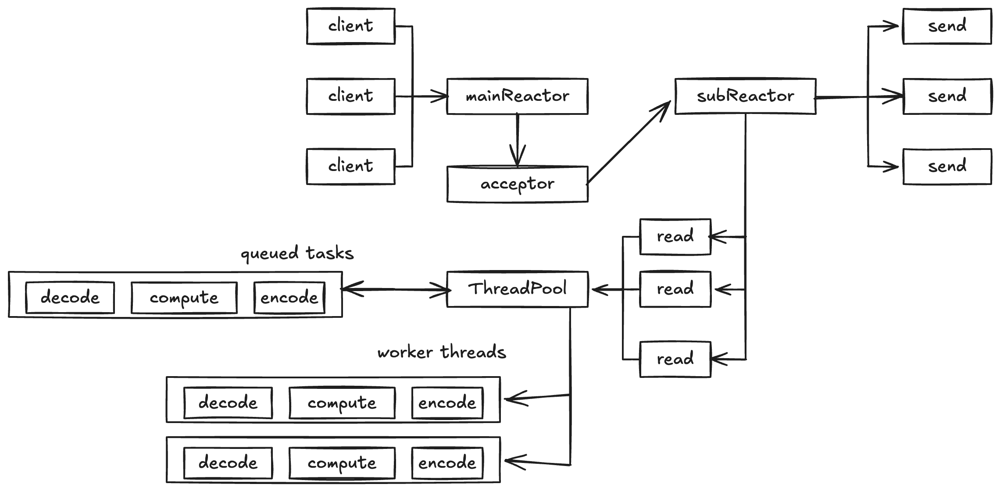
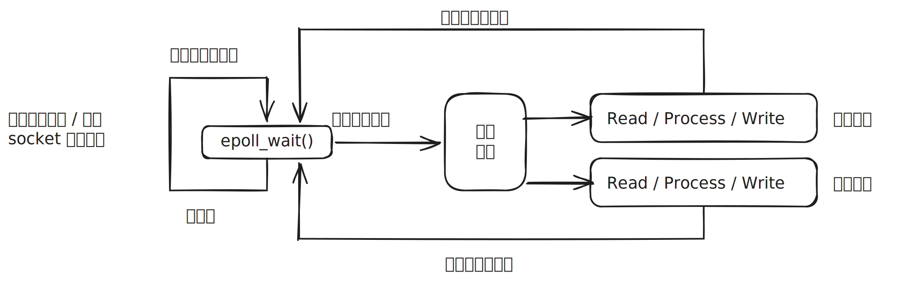

# Epoll

## 内核事件表和系统调用

Linux 特有的 I/O 复用函数，创建一个文件描述符标识内核的一个事件表，然后把用户关心的文件描述符上的事件放在这个事件表中，使用 `epoll_create` 或 `epoll_create1` 创建事件表：

```cpp
#include <sys/epoll.h>
int epoll_create(int size);
int epoll_create1(int flag);
```

返回文件描述符。`epoll_create` 的 `size` 仅用于提示内核事件表的大小。`epoll_create1` 更现代化，引入了`flags`参数，允许传递标志来控制`epoll`实例的特性，例如 `EPOLL_CLOEXEC` 设置`close-on-exec`标志，使得这个文件描述符在执行`execve()`后自动关闭，避免资源泄露。

使用 `epoll_ctl` 操作内核事件表：

```cpp
int epoll_ctl(int epfd, int op, int fd, struct epoll_event *event);
```

成功返回 `0`，失败返回 `-1` 并设置 `errno`。`epfd` 为刚才创建好的事件表的文件描述符，`op` 指定操作类型，`fd` 为要操作的文件描述符，`event` 指定事件。

操作类型有3种宏：`EPOLL_CTL_ADD` 往事件表中注册 `fd` 的事件，`EPOLL_CTL_MOD` 表示修改，`EPOLL_CTL_DEL` 表示删除。

`event` 的类型是结构体 `epoll_event`，包括事件和对应用户数据，其中用户数据的类型是一个 `union`：

```cpp
struct epoll_event {
	__uint32_t events; // epoll 事件
	epoll_data_t data; // 用户数据
}

typedef union epoll_data{
	void* ptr; // 指定相关用户数据
	int fd; // 指定事件所属的目标文件描述符
	uint32_t u32;
	uint64_t u64;
} epoll_data_t;
```

设置好内核事件表后，使用 `epoll_wait` 系统调用，它在一段超时时间内等待一组文件描述符上的事件：

```cpp
int epoll_wait(int epfd, struct epoll_event* events, int maxevents, int timeout);
```

成功时返回就绪的文件描述符个数，失败返回 `-1` 并设置 `errno`，超时返回 `0`。

`maxevents` 指定最多监听多少个事件。`timeout` 控制其阻塞行为，允许应用程序在等待多个文件描述符事件时实现非阻塞、阻塞或带超时等待。`timeout = -1` (无限期阻塞直到事件发生)，`timeout = 0`(立即返回，不阻塞)，大于 0 (阻塞指定毫秒数，但不保证精确)

`epoll_wait` 如果检测到事件，就把所有就绪的事件从 `epfd` 指向的内核事件表复制到 `events` 指向的数组，该数组只输出 `epoll_wait` 检测到的就绪事件，提高了应用程序索引文件描述符的效率，和 `select` 和 `poll` 的数组有所不同。
## 操作模式
默认以 LT 工作
- LT(Level Trigger)：相当于效率较高的 `poll`。支持非阻塞和阻塞 socket。`epoll_wait` 监测到该事件 `fd` 已经就绪并通知应用程序后，可以不立即处理该事件（对一个 fd 进行 I/O 操作），然后每调用一次 `epoll_wait` 就继续通知直到该事件被处理。
- ET(Edge Trigger)：只支持非阻塞 socket。`epoll_wait` 监测到该事件 `fd` 已经就绪并通知应用程序后，必须立即处理该事件，做了某些操作直到该 `fd` 不再是就绪状态。注意变成就绪态后，如果一直不对这个 `fd` 作 I/O操作从而导致它再次变成未就绪，内核不会发送更多的通知。ET 降低同一个事件被重复触发的次数，效率比 LT 更高。

# Reactor模式

Reactor 是用面向对象思想对 I/O 复用进行的封装，用于同步 I/O
Reactor可以有一个或多个，处理资源池可以是一个或多个进程 / 线程，可分为单 Reactor 单线程 / 单 Reactor 多线程 / 多Reactor 多线程三种模式。

## 中心思想

将所有要处理的I/O事件注册到一个中心 I/O 多路复用器上，同时主线程/进程阻塞在多路复用器上，主线程（I/O 处理单元）**只负责监听文件描述上是否有事件发生**，一旦有I/O事件到来或是准备就绪(文件描述符或socket可读、写)，多路复用器返回并将事先注册的相应I/O事件分发到对应的处理器中。

## 事件驱动机制

**和普通函数调用不同，并不是主动调用 API 处理事件，而是应用程序需要提供相应的接口并注册到Reactor上，先有事件发生，再由 Reactor 主动调用应用程序注册的接口，这些接口是类中的回调函数**。

事件驱动机制可以用软件工程的 Hollywood 原则形容，即 *"Don't call us, we'll call you"*，用于软件工程以降低模块间耦合。在高层组件（如框架）与低层组件的关系中，低层组件将自己挂钩到系统，由框架负责在其需要时主动调用低层组件，实现了控制反转。Reactor 并没有被具体的事件处理器调度，而是管理器调度具体的事件处理器，由事件处理器对发生的事件作出处理，这就是Hollywood 原则。

Reactor 模式与 Observer 模式在某些方面极为相似：当一个主体发生改变时，所有依属体都得到通知。不过，Observer 模式与单个事件源关联，而 Reactor 模式则与多个事件源关联。观察者模式允许对象在状态改变时通知多个观察者对象。`std::function` 可以用来存储观察者对象的回调函数，使得实现观察者模式更加灵活和简洁。

## 参与部件

### 描述符

操作系统提供的资源，用于识别每一个事件，如 Socket 描述符、文件描述符、信号的值等。
在Linux中，它用一个整数来表示。事件可以来自外部，如来自客户端的连接请求、数据等。事件也可以来自内部，如信号、定时器事件。

### 同步事件多路分离器

事件循环：事件的到来是随机的、异步的，无法预知程序何时收到一个客户连接请求或收到一个信号。所以程序要循环等待并处理事件。

在事件循环中，等待事件一般使用I/O复用实现。一般是 `select`、`poll`、`epol_waitl` 等系统调用，用来等待一个或多个事件的发生。I/O 框架库一般将各种 I/O 复用系统调用封装成统一的接口，称为事件多路分离器。调用者会被阻塞，直到分离器分离的描述符集上有事件发生。

### 事件处理器

I/O 框架库提供的事件处理器通常是由一个或多个模板函数组成的接口。这些模板函数描述了和应用程序相关的对某个事件的操作，用户需要继承它来实现自己的事件处理器，即具体事件处理器。

事件处理器中的回调函数可以有多种实现方式，比如
1. 用传统的虚类、虚函数来设计一个接口，缺点是使用麻烦，程序可读性差
2. C++11 的 `std::function` 和 `std::bind`，右值引用，`std::move`，然而现在有更新的标准， `std::bind` 已建议不要使用
3. 待补充

### 具体的事件处理

事件处理器接口的实现。它实现了应用程序提供的某个服务。每个具体的事件处理器总和一个描述符相关。它使用描述符来识别事件、识别应用程序提供的服务。

### Reactor 管理器

一个类，定义了一些接口，用于应用程序控制事件调度，以及应用程序注册、删除事件处理器和相关的描述符。它是事件处理器的调度核心。 Reactor 管理器使用同步事件分离器来等待事件的发生。一旦事件发生，Reactor管理器先是分离每个事件，然后调度事件处理器，最后调用相关的模 板函数来处理这个事件。

## 为什么网络编程要使用 Reactor

只使用 I/O复用的 `epoll` 已经可以使服务器并发几十万连接，但是软件工程层面上不够。I/O 复用接口的一次调用返回若干个活跃连接等待处理，先根据连接的指针找出对象，然后循环处理每个连接找出对象的上下文状态，再用 `read` `write` 来获取操作内容，结合上下文状态查询此时应当选择哪个业务方法处理，调用相应方法完成操作后，若请求结束，则删除对象及其上下文。

单纯 I/O 复用是面向过程的，达不到快速响应。Reactor 将事件驱动框架分离出具体业务，将不同类型请求之间用面向对象的思想分离。通常，Reactor 不仅使用 I/O 复用处理网络事件驱动，还会实现定时器来处理时间事件的驱动（请求的超时处理或者定时任务的处理）。

## Reactor 的模式

### 单线程模式

Reactor 负责多路分离套接字，Accept 新连接，并分派请求到处理器链中。该模型适用于处理器链中业务处理组件能快速完成的场景。但不能充分利用多核资源。

### 单 Reactor 多线程模式

在事件处理器链部分采用了多线程 / 线程池，是后端程序常用的模型。

### 多 Reactor 多线程模式

将 Reactor 分为两部分，mainReactor负责监听并 accept新连接，然后将建立的 socket 通过多路复用器（Acceptor）分派给 subReactor。subReactor 负责多路分离已连接的 socket，读写网络数据，业务处理功能，其交给 worker 线程池完成。通常，subReactor 个数上可与CPU个数等同。



## 网络编程范例

半同步半异步的范例，线程池为同步，Reactor 为异步



1. 主线程往 epoll 内核事件表中注册 socket 读就绪事件
2. 主线程调用 `epoll_wait` 等待 socket 上有数据可读
3. 当 socket 上有数据可读，`epoll_wait` 通知主线程。主线程则将 socket 可读事件放入请求队列
4. 睡眠在请求队列上的某个工作线程被唤醒，从 socket 读取数据，处理客户请求，然后往 epoll 内核事件表中注册该 socket 上的写就绪事件
5. 主线程调用 `epoll_wait` 等待 socket 可写
6. 当 socket 可写时，`epoll_wait` 通知主线程，主线程将 socket 可写事件放入请求队列
7. 睡眠在请求队列上的某个工作线程被唤醒，往 socket 写入服务器处理客户端请求的结果