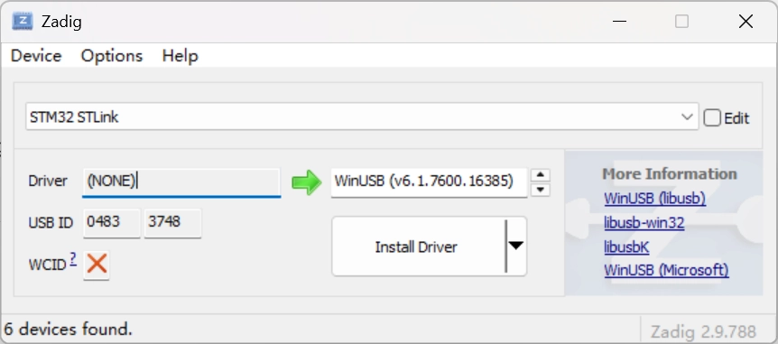

## 工具介绍

### 交叉编译工具链

ARM-GCC是一套交叉编译工具链家族，其命名规则统一为：**arch [-vendor] [-os] [-(gnu)eabi]**：

- **arch**代表芯片的体系架构，比如ARM，MIPS等
- **vendor**代表工具链的提供商
- **os**代表目标开发板所使用的操作系统
- **eabi**代表 **Embedded Application Binary Interface**，即嵌入式应用二进制接口

使用的是 **arm-none-eabi-gcc** (ARM architecture, **no** vendor, **not** target an operating system, complies with the ARM EABI)主要用于编译ARM架构的裸机系统（包括ARM Linux的Boot和Kernel，不适用编译Linux应用），一般适合ARM7、Cortex-M和Cortex-R内核等芯片使用，不支持那些跟操作系统关系密切的函数。除此之外，该编译器在底层使用了newlib这个专用于嵌入式系统的C库。

### OpenOCD

Open On-Chip Debuger 调试器。硬件的ROM、RAM或FLASH空间是非常有限的，你只有通过学习才能知道如何通过设置编译器的命令参数来优化.bin或.elf生成文件的大小。除此之外，你还能通过配置链接脚本中TEXT段、DATA段、BSS段以及堆、栈的起始地址和空间容量等参数来获得定制STM32程序运行时的能力。

## 安装必要项

在你的wsl发行版中用包管理器安装 gcc, g++, cmake, ninja, openOCD

目前找到的教程是使用wsl1的，因为不支持外设和wsl1通信所以他使用的是在宿主机安装openOCD然后挂载到wsl里的方法，wsl2使用这个方法会造成tcl port通信的问题，很麻烦，直接在wsl2里安装openOCD然后在settings.json里指明路径就好了

## 在vscode中开发构建好的项目

使用STM32CubeMX通过cmake生成项目后，通过挂载路径在vscode远程连接wsl打开，可以把他移到你喜欢的位置。源码位于Core文件夹中，里面的两个文件夹分别包含头文件和.c文件，主循环在 `main.c` 中

### build

安装cmake拓展，对于生成好的工程项目点击下方状态栏的build即可构建，构建前确认安装好cmake和ninja，使用cmake构建Release，生成的东西会在 `build/Release`文件夹，注意有没有`compile_commands.json`

### clangd无法找到头文件的问题

在工作区设定的`settings.json`里添加clangd参数

```json
{
    "cortex-debug.gdbPath": "/usr/bin/gdb-multiarch",
    "cortex-debug.openocdPath": "/mnt/d/openocd-v0.12.0-i686-w64-mingw32/bin/openocd.exe",
    "clangd.arguments": [
        "--compile-commands-dir=build/Release"
    ]
}
```

之后在命令中选择重启clangd就会生效

## 运行一个Demo

f103c8t6的PC13点灯

```c
int main(void)
{
    HAL_Init();                // 1. HAL 库初始化
    SystemClock_Config();      // 2. 配置系统时钟
    MX_GPIO_Init();            // 3. 初始化 LED 对应的 GPIO

    while (1)
    {
        HAL_GPIO_TogglePin(GPIOC, GPIO_PIN_13); // 4. 翻转 LED 引脚电平
        HAL_Delay(500);                         // 5. 延时 500ms
    }
}
```

## 连接st-link v2到wsl调试

vscode远程连接时安装cortex-debug扩展，在宿主机安装usbipd，找到STLink的设备

```sh
winget install usbipd # 安装
usbipd list

Connected:
BUSID  VID:PID    DEVICE                                                        STATE
1-4    048d:c102  USB 输入设备                                                  Not shared
2-3    0489:e0d8  RZ616 Bluetooth(R) Adapter                                    Not shared
7-2    3710:5406  USB 输入设备                                                  Not shared
7-3    0483:3748  STM32 STLink                                                  Not shared

Persisted:
GUID                                  DEVICE
```

使用[Zadig](https://zadig.akeo.ie/)替换驱动，可以发现原来根本没有装驱动，点击安装



绑定设备

```sh
usbipd bind --busid 7-3
usbipd attach --wsl --busid 7-3
usbipd: info: Using WSL distribution 'Ubuntu' to attach; the device will be available in all WSL 2 distributions.
usbipd: info: Loading vhci_hcd module.
usbipd: info: Detected networking mode 'mirrored'.
usbipd: info: Using IP address 127.0.0.1 to reach the host.
```

回到wsl中使用lsusb查看，如果没有lsusb按照终端指示安装，找到St-link

```sh
lsusb
Bus 001 Device 001: ID 1d6b:0002 Linux Foundation 2.0 root hub
Bus 001 Device 002: ID 0483:3748 STMicroelectronics ST-LINK/V2
Bus 002 Device 001: ID 1d6b:0003 Linux Foundation 3.0 root hub
```

在左边run & debug页面点击生成 launch.json ，设定好调试服务器和可执行文件，svd自己去谷歌找，放入项目目录。注意executable项目因人而异，总之要找到可执行的 .elf 文件

```json
{
    "version": "0.2.0",
    "configurations": [
        {
            "name": "STM32F103",
            "cwd": "${workspaceFolder}",
            "type": "cortex-debug",
            "request": "launch",
            "servertype": "openocd",
            "executable": "${workspaceFolder}/build/Release/1LED.elf",
            "device": "STM32F103C8",
            "configFiles": [
                "interface/stlink.cfg",
                "target/stm32f1x.cfg"
            ],
            "svdFile": "${workspaceFolder}/STM32F103.svd",
            "runToEntryPoint": "main",
            "showDevDebugOutput": "raw",
        }
    ]
}
```

