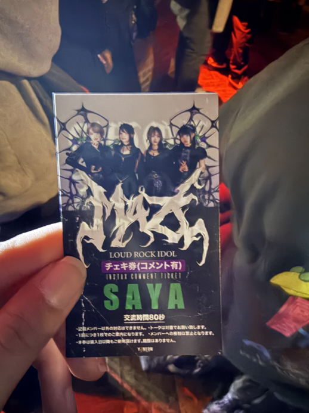
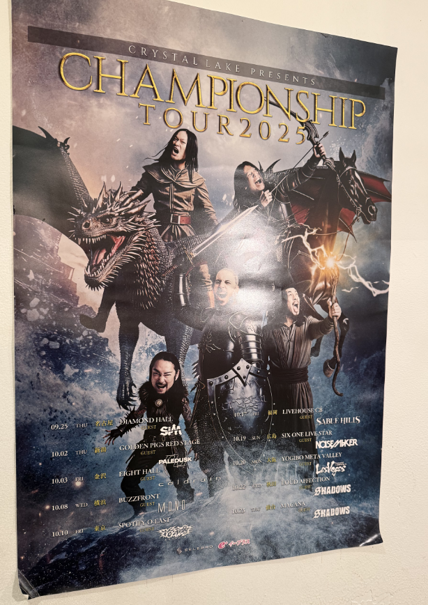
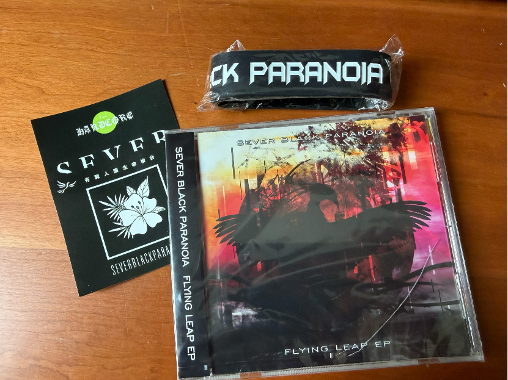
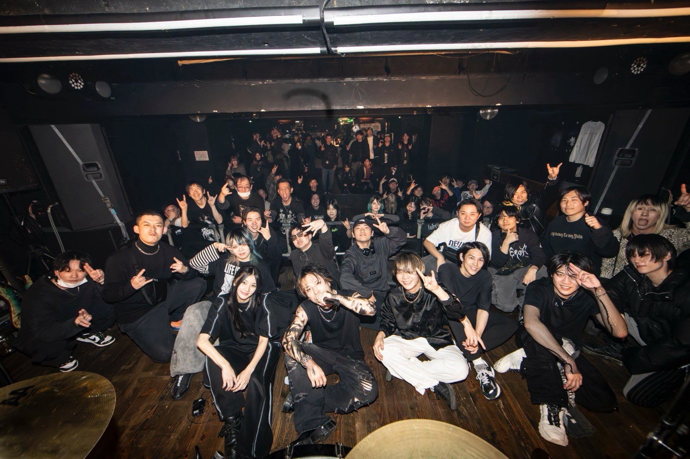

在8月底得知Fear, and loathing in Las Vegas要开Phase2的The focus专辑巡回，想到Phase2对于自己来说算是入坑作品，意义非凡，再加上东京场举办时间难得自己有时间，发现国际友人K和友人N也要去，就决定自己也去了。之后发现来都来了那不得多看几天live？正好发现赌城前成员Sxun担任Sound Producer的重型女团MAZE和东京暗黑电子核个人企划SEVER BLACK PARANOIA分别在17, 18都有live，于是这次变成了完全以电子核live为主的自由行，也是一次在考研之后的放松。

## 前期准备

无论是票务还是交通都建议使用iphone，实在不行找家里人借一台或者收一台，国内安卓没有谷歌套件懂得都懂，而且日本app安卓版本下载基本直接给你重定向到谷歌app商店了，这些在iphone就是切换到外区账号就能解决的事。

### 票务

Eplus是日本live最常用的app之一，TIGET和Live Pocket只有网页，一般是没主流出道团体的小规模live。注意livehouse入场时需要交ドリンク代，有时候会给一张ドリンク代的券，凭券可以免费喝一杯饮料。根据live规模的不同ドリンク代支付方式也不同，大体上只要准备现金就可以，赌城在Zepp Haneda的这种相对大规模的livehouseドリンク代可以用Suica付款，当然apple wallet和实体卡都可以。小一点的livehouse例如MAZE的SPACE ODD和SBP的涉谷Garret不仅ドリンク代，甚至物贩都是仅限现金和paypay，而paypay需要有日本的电话号才能用。

#### Eplus平台

赌城的one-man live和主办的音乐节MEGA VEGAS的抽选分为两种，一个是[VEGASTATION](https://vegastation.jp/)即粉丝俱乐部先行，需要入会费330日元即可提前抽票，第二个是eplus的官方WEB先行抽选，在官方推特会放出链接。这次我因为错过了VEGASTATION抽选，就参加了官方WEB先行抽选。VEGASTATION的抽选入场顺序会更前一点。虽然说是抽选，但是赌城现在人气没以前那么高，只要应募抽选了基本上都是点击就送。~~有的场甚至到最后直接卖票了还卖不完导致在ins上开直播宣传~~

抽选应募的时候可以选择付款方式（通常是信用卡和便利店付款）和用哪种票入场，一种是在便利店换纸质票，另一种是スマチケ，注意スマチケ是电子实体票，和手机绑定，下载了スマチケ后不能把eplus卸载，也不能换手机，否则票会丢失。

#### TIGET平台

这次去的是拼盘エキセントリックトーキョー，每个团仅演出25min，MAZE出场是第一个，同时演出完立刻开始特典会。在TIGET上注册账号并验证电子邮箱，由于是预约票所以并不需要电话验证，在当天的livehouse内使用现金付款即可。

#### Live Pocket平台
Live Pocket购票需要电话号认证，本人是+86手机号，开了漫游之后尝试发短信认证后还是无法认证，用打电话完成认证。在网页上即可用信用卡完成付款，入场时点击チケットを表示，出示二维码，交ドリンク代入场即可。

## 入境准备

确认抽到票之后我在9月中旬开始准备入境需要的护照，机票，酒店等。

### 护照

可以在移民局12367现场办证预约申请，但是本人当时所在地区似乎不如直接带身份证去线下办理来的快。工本费120元一周后取得。

### 签证

办理大学生签证(V44 Tokudai)，有效期3个月停留期15天，通常需要提供学信网学历验证报告，护照，2寸白底彩照，户口本复印件，身份证正反面复印件等，具体材料以下单的旅行社为准。本人是福建户口走广东领区，办签证的价格不知道为什么比别的户籍的学生多出来一百块，另外福清和长乐疑似不可以办。~~地域debuff~~

### 机票

这次的机票去程是厦门高崎-上海虹桥-上海浦东-东京羽田(1517元)，回程是东京成田-重庆江北-厦门高崎(1199元)，均需要重新托运行李。注意不要购买廉航，不要买live当天的机票以防延误了赶不上，这次16号赌城live据说浦东机场延误导致有群友赶不上了。还有尽量提前在线值机，不能在线值机的早点去机场人工值机否则可能碰到超售，被迫改签或取消航班。正常情况下建议提早2小时到机场。

虹桥机场到浦东机场有直通地铁，大约1个半小时到。第二程浦东到羽田本人第一次乘坐大的机型，乘坐的是波音777，空间相对宽敞。如果票价相差不大建议选择羽田机场，羽田到市中心有电车直通，而成田需要乘坐skyliner，通常是在站内排队买票，过闸机的时候把票插进去即可。

本人回程从涉谷站坐到上野站，然后乘坐skyliner直到成田机场T1，票价2580jpy=113cny，大约40分钟。其中第一程大约凌晨12点到江北机场，第二程是早上8点，完完全全是红眼航班，晚上在长椅上凑合基本上睡不着熬通宵了，建议不要这么搞。另外额外提醒**江北机场的睡眠舱位于国内到达的内部**，我是国际到达，出来就是海关，发现完全无法直接走到国内到达，导致睡眠舱的钱白白浪费110cny。其次江北机场安检极其暴力，安检查出包里有一盒银耳羹直接开始翻箱倒柜，友人K送我的cd直接被安检摔裂了。

### 酒店

本人15号晚上到羽田，16号在zepp haneda的live，这两天住的是在大鸟居站旁边的胶囊旅馆Beagle Tokyo Hostel & Apartments，一楼有吃饭的地方，定食大约800jpy，晚上还提供啤酒。酒店有独立卫浴，甚至提供洗面奶和板夹。公共休息区有自动贩卖机。定食大概如下图。

之后17号早上移动去新宿。注意酒店通常在早上10点要求退房，而入住办理时间根据酒店不同有所不同，17-18号住的酒店是涉谷的胶囊旅馆 Nadeshiko Hotel Tokyo Shibuya by Unito Female-Only，仅限女性，公共大浴场，有温泉。离涉谷站大约1km，步行很方便，酒店早上10点后无法使用公共dressing room，下午4点之后才能办理入住而且前台经常不在，比较麻烦。一楼有洗衣机。

### Visit Japan Web

一般在飞机上空姐就会提示你拍下visit japan web的网址二维码进行填写。由于通讯并非可靠建议提前就把visit japan web填好，到时候入境只要走通道时出示入境的二维码即可。

### 消费

东京的商店基本都支持微信和支付宝。本人在日期间完全使用中国银行的万事达储蓄卡，没发生过什么问题。现金可以在国内就取好也可以在当地的atm取，atm的话手续费有点高，部分atm甚至只允许取以10000jpy为单位的现金（涉谷某个全家便利店）

### 交通

交通卡因为我是iphone，直接在apple wallet里面添加suica，过闸机的时候刷手机就行，乘车使用苹果自带的地图就可以看换乘信息了。

## 1/16 Fear, and loathing in Las Vegas: The Focus phase 2

Livehouse：Zepp羽田

下午3点的时候物贩开始，2点多的时候就已经很多人在排队了。以往会有概率在物贩的时候见到成员，现在基本上没这种机会。我因为替朋友分发无料制品就提前很早去，大约50分的时候朋友会合，过了一会碰到其他日本友人并将无料全部发完，在此十分感谢。3点多购买完物贩去了旁边的咖啡店小坐一下，等到约五点的时候出来寄包，等待入场。入场的D代可以用suica付，大部分应该是只能付现金硬币。

这次的live的set除了phase2全曲还有 Song of Steelers, Break Out Your Stained Brain, Until You Die Out, The Gong of Knockout，Fist for the New Era, Corssover 还有给RAISE A SUILEN供曲 Drown Out the Noise and Push Through the Trash 的本家版本，值得一提的是phase2巡演全系列似乎都唱了Twilight，这也是本人很喜欢的歌，这次终于能听到了。另外不知道这段时间突然开始唱Twilight是不是因为隔壁MAZE也发了新歌Twilight(?)

说到Phase2最喜欢的是Rave-up tonight，是因为很早的时候在网上看流出的音乐节出演视频，这首基本上是定番，从那个时候起就非常喜欢sxun的和声还有中间吉他的部分，现在听不到了，在现场的时候其实还是觉得有点寂寞。

live结束后和友人K和友人N在旁边的酒吧[HANEDA SKY BREWING](https://tabelog.com/tokyo/A1315/A131504/13248845/)打ち上げ，令人意外的是这家店也在放FaLiLV的歌。友人K由于在日本还算是未成年就没有喝酒，我们点了披萨和通心粉。

晚上回酒店之后又复习了当年release live的大阪场。然后官方推特发的recap视频里刚好把我和朋友几个拍进去了，第一次在日本参战居然能有如此收获还是很意外，要是是以前的时候就更好了。

## 1/17 MAZE: エキセントリックトーキョー

Livehouse: 代官山SPACE ODD

今天最主要的行程是去看MAZE参与的拼盘Live。白天因为酒店入住是下午四点才开始，不得不拖着行李箱在涉谷当特种兵...

10点在酒店退房后乘电车前往涉谷，中途不小心坐错站了，险些成为京急高手。和友人K在涉谷站出口会和后，去了Tower Records涉谷店。Tower Reocrds涉谷店部分楼层在装修所以没开放，进去1F都是热门，最顶层是洋楽。与友人N会和后打算找地方吃饭，友人N的朋友推荐了一家咖啡厅，有做brunch。进去了之后发现是执事咖啡，于是三个人对着昂贵的菜单不知所措。菜单上除了甜品类价格非常吓人，甚至还有规则要求每2h必须点一单。我们正常的点了蛋包饭和意面（和昨天的区别是没有饮料...）之后去附近另一家Tower Records领我预定的cd，不过在3月之后强制电话号认证，以后大概没有日本电话号会越来越麻烦吧...

下午拖着行李箱去涉谷的livehouse代官山UNiT，MAZE是第一个，setlist是很常规的set，ANIMUS->ROAR->Idol Riot->Ultimate Gorilla Bomber->Supersonic->Goodbye Bad Memories，MAZE演完我和友人K去特典会和Saya拍cheki，中途和Saya介绍了友人K是外国人，今天带她来享受一下，被她夸我很温柔(?)

## 1/18 SEVER BLACK PARANOIA pre. SBP Fest vol.14 -Urban Paganism-

Livehouse：渋谷GARRET

出演：Ambivalenth; / CRISIS CODE / Nimbus / HAILROSE / SEVER BLACK PARANOIA

早上没什么安排，陪着友人K去秋叶原逛街->吃饭->喝咖啡->去livehouse的行程，充当友人K的翻译。这两天基本只说了日语和英语，导致回家之后语言系统都有点没切换过来。

Livehouse也算是东京金属核的圣地之一，另一家是新宿Antiknock，有机会希望可以圣地巡礼。拼盘Live和音乐节在入场交D代的时候需要向staff报出想看的乐队的名字，这涉及到乐队收入的分配比例。很意外的是进来发现Crystal Lake之前巡演的海报，完全忘记了...东京场的Guest是花冷え。

Live完之后和Ambivalenth;的键盘主唱Sxo聊天想起来对方好像在FaLiLV粉丝群体里还算是蛮有名的粉丝，想要买他们merch支持一下，但是想要用master card付钱折腾半天，最后还是付现金了。然后还和SBP的Daisuke聊到自己昨天去看MAZE，听了他担任作曲的IDOL RIOT，还和他说自己很喜欢ANIMUS，他在这首歌负责合成器编曲和极端嗓和声。当然从高中开始我个人就通过同人电音领域听到他的歌...主要是TOKYO BURST PROJECT和feat了lapix大专辑里一首歌，接下来我大概会专门写一篇blog介绍SBP...

CD是友人K给我发的2日翻译工资(?)，甚至还有橡胶手环和贴纸，感谢Daisukeさん的无料。其实还买了BAPTISMA的长袖tee没有拍到图里...

熟人看了认出我的话当没看见就好不要开盒我！小妹在此谢谢大家！