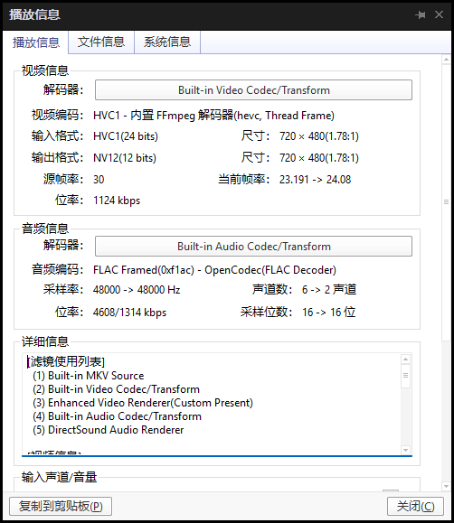

使用论坛里的人分享的电影压制参数，把音频从PCM变成128k的AAC，你觉得好听吗？

## 使用工具

- ffmpeg build: https://www.gyan.dev/ffmpeg/builds/
- ShanaEncoder: https://github.com/1265578519/ShanaEncoder/releases
- MKVToolNix: `choco install mkvtoolnix`

## ShanaEncoder压制参数



该配置主要用于压制live的dvd和bd，保留flac无损音频，经测试1080p的bd可以压制到原来60%大小。如果对于非live视频，把音频编码设置为AAC，比特率320k或128k可以满足需求。

配置的xml文件如下

```xml
<?xml version="1.0" encoding="utf-8"?>
<!--ShanaEncoder-->
<Settings>
  <inputparamBox />
  <prefixtextBox>[AKTK]</prefixtextBox>
  <extensiontextBox />
  <filterparamBoxV> -vf "shanasubtitle=1"</filterparamBoxV>
  <filterparamBoxA />
  <encparamBox> -f mkv -timestamp now
 -c:v libx265 -crf:v 19.0 -preset:v slow -tune:v none -libx265main10
 -c:a flac
 -sn -map_metadata -1 -map_chapters -0</encparamBox>
  <x264optsBox />
  <substyle>Format: Name, Fontname, Fontsize, PrimaryColour, SecondaryColour, OutlineColour, BackColour, Bold, Italic, Underline, StrikeOut, ScaleX, ScaleY, Spacing, Angle, BorderStyle, Outline, Shadow, Alignment, MarginL, MarginR, MarginV, Encoding
Style: Default,,22,&amp;H00FFFFFF,&amp;H0000FFFF,&amp;H00000000,&amp;H80000000,-1,0,0,0,100,100,0,0,1,2.5,2.5,2,10,10,20,1</substyle>
  <fontnameSE />
  <tonemapParam>zscale=transfer=linear:npl=100,format=gbrpf32le,zscale=primaries=bt709,tonemap=tonemap=hable:desat=0,zscale=transfer=bt709:matrix=bt709:range=tv,format=yuv420p</tonemapParam>
  <Logo>
    <logochk>False</logochk>
    <logopath />
    <logoalign>7</logoalign>
    <logox>5</logox>
    <logoy>5</logoy>
    <logow>0</logow>
    <logoh>0</logoh>
    <logos>1</logos>
    <logosd>1</logosd>
    <logoe>9</logoe>
    <logoed>1</logoed>
    <logoschk>True</logoschk>
    <logoechk>True</logoechk>
  </Logo>
</Settings>
```

## 常见操作一览

### 查看视频信息

使用ffprobe查看，命令为 `ffprobe video_name.mkv`，例如

```sh
ffprobe [AKTK]A2_t01.mkv
Input #0, matroska,webm, from '[AKTK]A2_t01.mkv':
  Metadata:
    creation_time   : 2026-07-01T02:08:18.000000Z
    ENCODER         : ShanaEncoder
  Duration: 00:04:15.93, start: 0.000000, bitrate: 3876 kb/s
  Stream #0:0: Video: hevc (Main 10), yuv420p10le(tv, progressive), 720x480 [SAR 853:720 DAR 853:480], 30 fps, 30 tbr, 1k tbn
    Metadata:
      ENCODER         : Lavc61.31.101 libx265
      DURATION        : 00:04:15.934000000
  Stream #0:1: Audio: flac, 48000 Hz, 5.1(side), s16 (default)
    Metadata:
      ENCODER         : Lavc61.31.101 flac
      DURATION        : 00:04:15.712000000
```

### 复制视频的章节信息到另一个视频

使用mkvtoolnix复制要导出章节的 `.xml` 文件，比较麻烦，使用ffmpeg一道命令就能解决。

从 `original.mkv` 复制章节到 `target.mkv`，输出视频为 `output_mkv`，不只是mkv格式，mp4格式也可以。

```sh
ffmpeg -i target.mkv -i original.mkv \
-map 0 \
-map_chapters 1 \
-c copy output.mkv
```

### 根据章节信息切分视频

根据章节切分`original.mkv`为`output(1).mkv`, 'output(2).mkv`等

```sh
mkvmerge -o output.mkv --split chapters:all original.mkv
```

### 提取视频的音源为flac

提取`original.mkv`的音源为`output.flac`

```sh
ffmpeg -i original.mkv -map 0:a -c:a flac output.flac
```


